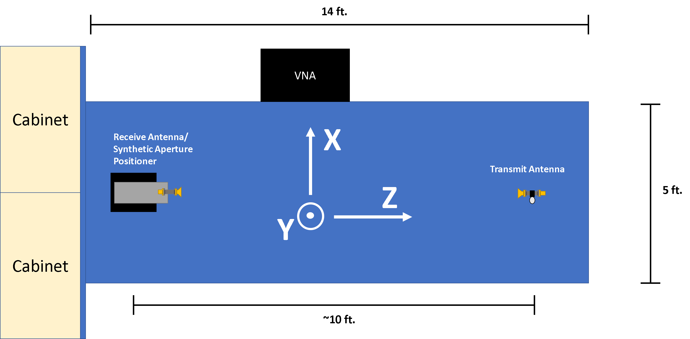

.. _creating-apertures:

Creating New Synthetic Apertures
==================================

When using the :meth:`samurai.acquisition.SamuraiSystem.SamuraiSystem.csv_sweep`, the inputs are provided as a comma separated value (CSV) file for positions of the robot.
Each of the positions for the robotic positioner is given in a (x,y,z,alpha,beta,gamma) format where x,y,z are the cartesian positions (in mm), and alpha,beta,gamma are the rotation
of the robot (in degrees) about the x,y,z axis respectively.

When using :class:`samurai.acquisition.SamuraiSystem.SamuraiSystem`, the coordinate system of the robot is automatically set as follows:

- The **x-axis** is from the left/right when looking from behind the robot with x=0 aligned with the center of the base of the robot 

- The **y-axis** is down/up when looking from behind the robot with y=0 on the optical table.
        
        - For other setups, it may be desirable to change this frame of reference or ensure that the positions are built with this offset in mind

- The **z-axis** is in/out when looking from behind the robot which is typically the propogation direction when using a horn antenna.

These axes can be seen with a representation of the robot on an optical table below.

Apertures are typically created with the help of the :class:`samurai.acquisition.support.SamuraiApertureBuilder` class. 
This class provides some convenient methods for quickly creating planar and cylindrical apertures along with writing them out to the correct format.

.. warning:: It should be known that apertures used by the :meth:`samurai.acquisition.SamuraiSystem.SamuraiSystem.csv_sweep` method
        are checked that they begin with a specific header. This header specifies the world reference frame (WRF) and tool reference frame (TRF).
        If these reference frames do not match those for which the aperture was created, damage can occur and therefore the following header must be included
        in each csv file

        .. code-block:: python 

           # TRF = [tx,ty,tz,ta,tb,tg]
           # WRF = [wx,wy,wz,wa,wb,wg]
           
        where [tx,ty,tz,ta,tb,tg] and [wx,wy,wz,wa,wb,wg] are the positions and orientations of the TRF and WRF respectively.
        These will be referenced against the values set for TRF and WRF in :class:`samurai.acquisition.SamuraiSystem.SamuraiSystem`.
        If Custom sweeps are created without using this class, it is important that these headers be added, and the correct corresponding reference 
        frames be passed to :class:`samurai.acquisition.SamuraiSystem.SamuraiSystem`.

Testing New Apertures 
---------------------------------

After creating a new aperture that has not been tested, it is recommended to run the robot through the point sweep before measurement to 
ensure no damage will occur due to the sweep. Because of the working volume of 6 axis robots, it is possible that some points cannot be reached
while others can only be reached through drastic movement. Taking precautions with new sweeps increase the probability of a successful measurement 
and help reduce the possibility of damaging any part of the system.

Testing with Simulation 
+++++++++++++++++++++++++++++++

When using the Meca500 robot, there is a capability to run a simulation mode. More information on the robot itself can be found in :ref:`running-the-robot`.
It is recommended to first test the robot using the simulation mode on the robot. This is done by:

#. Connect to the robots using the built in web interface in monitoring mode (while the robot is powered on and connected)

        - This is done by typing the robots IP address into any web browser and selecting 'monitoring'

#. Run :meth:`samurai.acquisition.SamuraiSystem.SamuraiSystem.csv_sweep` in simulation mode and without the VNA

        .. code-block:: python 

                # Import the library
                from samurai.acquisition.SamuraiSystem import SamuraiSystem 

                # Instantiate the object in simulation mode
                mysam = SamuraiSystem(is_simulation=True)

                # Connect and initialize the robot 
                mysam.connect_rx_positioner()

                # Run the sweep
                sweep_file_path = 'path/to/sweep/file.csv'
                mysam.csv_sweep('./',sweep_file_path,run_vna=False)

        This will run the aperture in the csv file without the VNA and in the simulation mode of the robot. This will still produce a metafile in the working directory, but will not produce any real data.

Testing with Simulation 
+++++++++++++++++++++++++++++++

After testing with simulation, it is recommended to again test the robot through the sweep while actually moving the joints, but without measuring data.

This is done by replacing the line 

.. code-block:: python 

        mysam = SamuraiSystem(is_simulation=True)

with 

.. code-block:: python 

        mysam = SamuraiSystem(is_simulation=False)

or simply 

.. code-block:: python 

        mysam = SamuraiSystem()

Replacing this line will still run without the VNA but will physically move the robot. This should be run with all devices mounted and with someone near the emergency stop.
:class:`samurai.acquisition.SamuraiSystem.SamuraiSystem` by default also reduces the speed of the robot to ideally give the user enough reaction time 
to hit the E-stop if needed. This also lets the user see if things like cables will get caught and pull on anything before an unsupervised measurement takes place.

Performing these two tests can increase chances of success in the final measurement (although nothing is gauranteed and many other issues may arise so always be cautious).

Creating a Planar Aperture 
--------------------------------

Here an example is given on how :class:`samurai.acquisition.support.SamuraiApertureBuilder` can be used to create a basic planar aperture.
This aperture emulates a 16x16 array at a spacing of 5.35mm which is about lamda/2 at 28GHz.

.. code-block:: python 

        # Generate a 16x16 planar aperture with 5.35mm spacing in all dimensions
        from samurai.acquisition.support.SamuraiApertureBuilder import ApertureBuilder
        myap = ApertureBuilder()
        out_path = './16x16_planar_28ghz_0.csv'
        center = [0,125,60,0,0,0]
        step = 5.35 # in mm
        myap.gen_planar_aperture_from_center(center,step=[step,step,step],numel=[16,16,1])
        myap.flip_alternate_rows(row_length=16) #flip the rows to speed up sweep
        myap.write(out_path) #write out

A second aperture with a 90 degree polarization can be created by simply by adjusting the z orientation of the :code:`center` variable

.. code-block:: python 

        # Generate a 16x16 planar aperture with 5.35mm spacing in all dimensions and 90 degree rotation
        myap90 = ApertureBuilder()
        out_path = './16x16_planar_28ghz_90.csv'
        center = [0,125,60,0,0,90]
        step = 5.35 # in mm
        myap90.gen_planar_aperture_from_center(center,step=[step,step,step],numel=[16,16,1])
        myap90.flip_alternate_rows(row_length=16) #flip the rows to speed up sweep
        myap90.write(out_path) #write out

If desired, these can then be combined into a single sweep with 

.. code-block:: python 

        out_path = './16x16_planar_28ghz_dualpol.csv'
        myap.concatenate(myap90)
        myap.write(out_path)

Downloads
++++++++++++++++

Each of these files can be downloaded below:

- :download:`16x16_planar_28ghz_0.csv<./external_data/16x16_planar_28ghz_0.csv>`
- :download:`16x16_planar_28ghz_90.csv<./external_data/16x16_planar_28ghz_90.csv>`
- :download:`16x16_planar_28ghz_dualpol.csv<./external_data/16x16_planar_28ghz_dualpol.csv>`