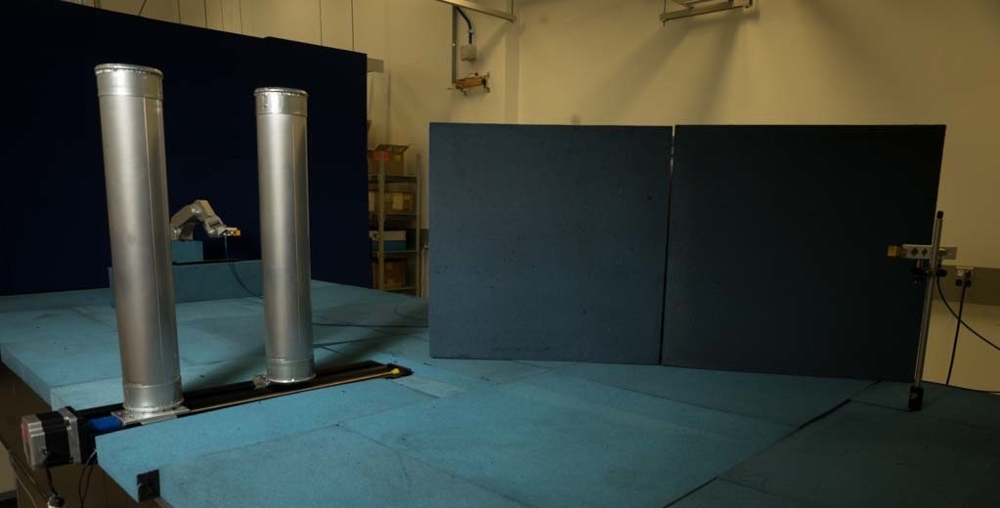

.. SAMURAI documentation master file, created by
   sphinx-quickstart on Mon Dec  9 09:14:57 2019.
   You can adapt this file completely to your liking, but it should at least
   contain the root `toctree` directive.

Welcome to SAMURAI's documentation!
===================================

- [S]ynthetic
- [A]perture
- [M]easurements with
- [U]nce[R]tainty and
- [A]ngle of
- [I]ncidence

Intoduction
----------------------

The SAMURAI system is a high accuracy millimeter-wave (mmWave) over the air (OTA) measurement system that utilizes a synthetic aperture method.
This system provides a testbed for a variety of OTA channel and device measurements as a function of both frequency and angle developed at the National Institute of Standards and Technology (NIST).
This system is designed to be both highly flexible and accurate utilizing a large signal network analyzer (LSNA) for measurement.
The LSNA allows the system to perform both linear and non-linear measurements along with a variety of other methods that are currently being researched at NIST.
The LSNA also allows very wideband measurements. Typically measurements are taken to match the operating frequency of the antenna which in most cases has been 26.5 GHz to 40 GHz
Typically the system resides on an optical table which provides stability over the possibly long measurement times. This also provides attachment points 
to repeatably reconfigure for a variety of different setups.    

*SAMURAI System Set up to test the scattering off of two cylinders. This test is used to test the angular resolution of different angle of arrival (AoA) algorithms.*

This documentation describes how the system is run, the data is stored, and options on how it can be processed.

Table of Contents
------------------------

.. toctree::
   quick_start/index
   acquisition/index
   analysis/index
   data/index
   base/index
   faq
   :maxdepth: 2
   :caption: Contents:

.. toctree::
   acquisition/running_bluetest
   acquisition/position_tracking
   :caption: In Progress

Copyright Notice
-----------------------
This software was developed by employees of the National Institute of Standards and Technology (NIST), an agency of the Federal Government and is being made available as a public service. Pursuant to title 17 United States Code Section 105, works of NIST employees are not subject to copyright protection in the United States.  This software may be subject to foreign copyright.  Permission in the United States and in foreign countries, to the extent that NIST may hold copyright, to use, copy, modify, create derivative works, and distribute this software and its documentation without fee is hereby granted on a non-exclusive basis, provided that this notice and disclaimer of warranty appears in all copies. 

THE SOFTWARE IS PROVIDED 'AS IS' WITHOUT ANY WARRANTY OF ANY KIND, EITHER EXPRESSED, IMPLIED, OR STATUTORY, INCLUDING, BUT NOT LIMITED TO, ANY WARRANTY THAT THE SOFTWARE WILL CONFORM TO SPECIFICATIONS, ANY IMPLIED WARRANTIES OF MERCHANTABILITY, FITNESS FOR A PARTICULAR PURPOSE, AND FREEDOM FROM INFRINGEMENT, AND ANY WARRANTY THAT THE DOCUMENTATION WILL CONFORM TO THE SOFTWARE, OR ANY WARRANTY THAT THE SOFTWARE WILL BE ERROR FREE.  IN NO EVENT SHALL NIST BE LIABLE FOR ANY DAMAGES, INCLUDING, BUT NOT LIMITED TO, DIRECT, INDIRECT, SPECIAL OR CONSEQUENTIAL DAMAGES, ARISING OUT OF, RESULTING FROM, OR IN ANY WAY CONNECTED WITH THIS SOFTWARE, WHETHER OR NOT BASED UPON WARRANTY, CONTRACT, TORT, OR OTHERWISE, WHETHER OR NOT INJURY WAS SUSTAINED BY PERSONS OR PROPERTY OR OTHERWISE, AND WHETHER OR NOT LOSS WAS SUSTAINED FROM, OR AROSE OUT OF THE RESULTS OF, OR USE OF, THE SOFTWARE OR SERVICES PROVIDED HEREUNDER.

Indices and tables
==================

* :ref:`genindex`
* :ref:`modindex`
* :ref:`search`
